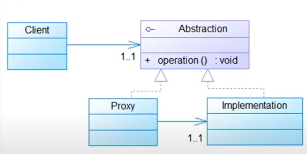

# Proxy Pattern
Catégorie : Structure

Objectif du pattern : foumir un intermédiaire entre ra ptrtie cliente et un objet pour contrôfer fes accès à ce
dernier.

Résultat : isoler le comportement lors de l'accès à un
objet.

